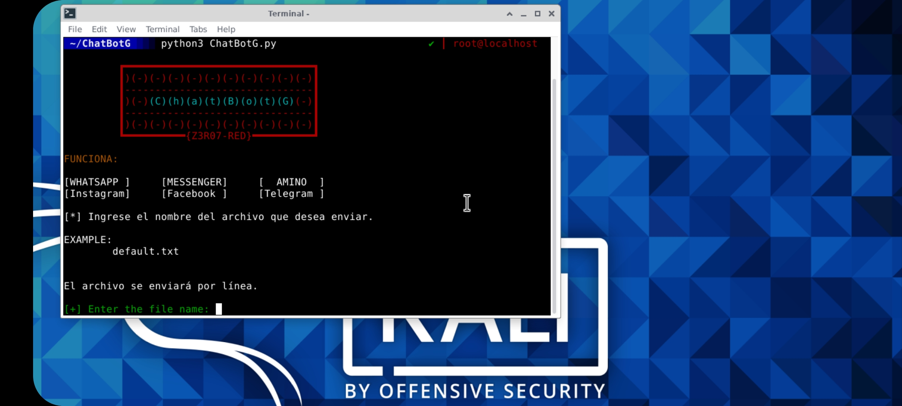

Es un bot para chats, funciona en kali linux. Su uso es muy sencillo, solo debes crear un archivo en el directorio de `chats` y escribir en él lo que quieres que envíe el bot, luego ejecuta el programa, pero ya tienes que tener listo un chat abierto, ya que será. para ir muy rápido al chat después de ejecutar el script e indicar el archivo a enviar.

<p align="center">

</p>

Requisitos previos:
======
Es necesario instalar las siguientes utilidades a nivel del sistema:

```
apt-get install python3 -y
```
```
apt-get install python3-pip
```

```
pip3 install pyautogui
```

DESCARGAR:
======

```
git clone
```

USAR:
======

```
cd ChatBotG/
```

```
chmod +x ChatBotG.py
```

```
python3 ChatBotG.py
```

* Antes de los comandos anteriores, debe crear un archivo `txt` en el directorio de `chats` y escribir en él lo que desea que escriba el bot.
* Luego ingrese el archivo que creo.
* Luego, vaya lo más rápido posible a un chat y coloque el cursor sobre el chat.

